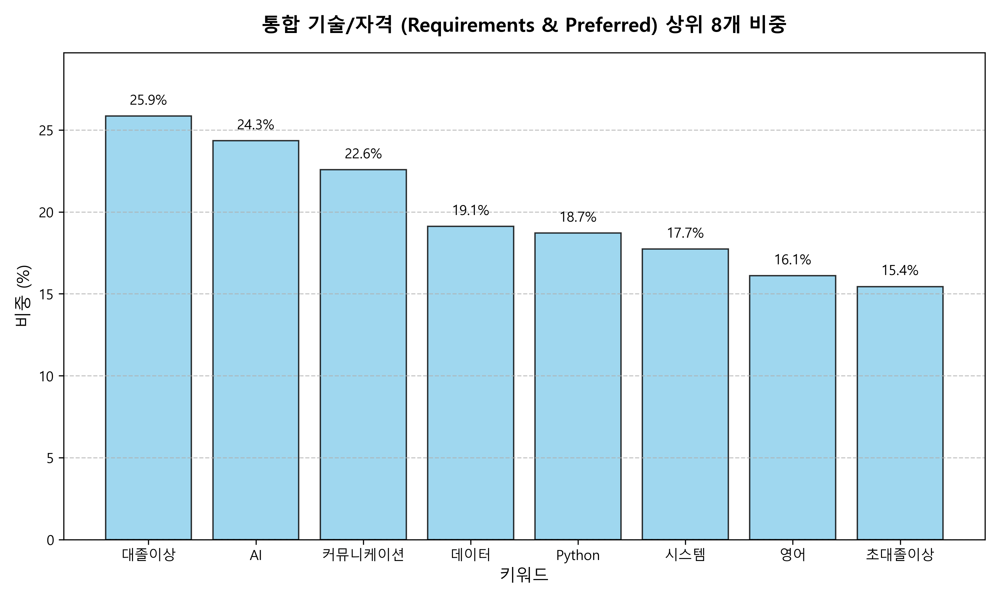

~~~
/
├── 00_input_data/           # 분석의 기초가 되는 전처리된 채용 공고 데이터
├── 01_preprocessing/        # 데이터 정제 및 동시 출현 빈도 산출
│   ├── scripts/             # 전처리 코드
│   └── results/             # 전처리 완료된 행렬 데이터
├── 02_analysis/             # 네트워크 분석 및 중심성 지표 계산
│   ├── scripts/             # 네트워크 빌드 및 PageRank 분석 코드
│   └── results/             # 중심성 지표 산출물 (.csv)
└── 03_visualization/        # 최종 결과 시각화
    ├── scripts/             # 그래프 생성 및 키워드 탐색 코드
    └── figures/             # 최종 네트워크 그래프 이미지 (.png)
~~~
pip install pandas networkx matplotlib scipy

1. 데이터 전처리: 01_preprocessing/ 코드를 실행하여 기초 행렬 생성
2. 네트워크 분석: 02_analysis/ networkX.py 및 pagerank.py를 순차적으로 실행하여 그래프 개체와 중심성 지표를 생성합니다.
3. 결과 시각화: 03_visualization/ 내 graphmaker.py를 실행하여 네트워크 그래프를 시각화합니다.

--- 주요 분석 내용 ---
 - 기술 생태계 규명: 네트워크 분석을 통해 IT 채용 시장의 핵심 생태계(AI데이터, 백엔드, 시스템, 네트워크)를 도출하였습니다.
 - 중심성 지표: PageRank 및 매개 중심성(Betweenness Centrality)을 연산하여 시장 내 지배력 있는 핵심 네트워크 기술 역량을 수치화했습니다.
 - 맞춤형 탐색: keyword_select_graph.py를 통해 특정 기술 키워드와 연관된 부분 네트워크를 실시간으로 탐색할 수 있습니다.

 --- 참고사항 ---
 1. 분석의 기초가 되는 데이터는 00_input_data/ 폴더 내에 위치합니다.
 2. 모든 스크립트의 파일 입출력 경로는 상대 경로(../)를 기준으로 설정되어 있어 폴더 구조 유지 시 별도의 수정 없이 실행 가능합니다.

 ### 주요 분석 결과

